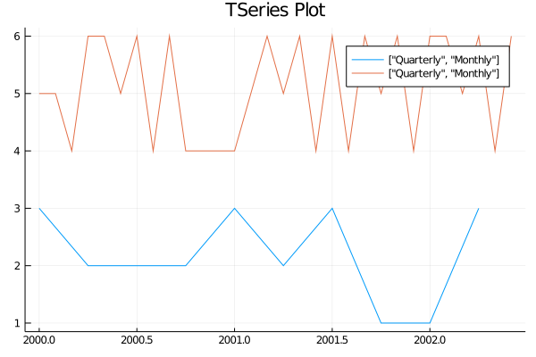

# TimeSeriesEcon

All the code contained here is also available in this file: [`main.jl`](main.jl).

```@contents
Pages = ["main.md"]
Depth = 3
```

```@setup tse
using TimeSeriesEcon
using Plots
```

## Part 1: MIT and TSeries

### Initialize MITs and TSeries

`MIT` (Moment-in-Time) is a primitive type based on 64-bit signed integers that 
represents discrete dates. There are two ways to initialize 
MITs: 
 - (1) directly `2020M8`, or 
 - (2) using the functional form `mm(2020, 8)`.

Internally, `MIT` contains `Frequency` information - more on this in the next section. 

```@repl tse
mit_integer = 2000U  # ii(2000)

mit_monthly = 2020M8 # mm(2020, 8)

mit_quarterly = 2020Q3 # qq(2020, 3)

mit_yearly = 2020Y  # yy(2020)
```

`TSeries` is subtype of AbstractVector and represents 1-dimensional time-series. A key feature of `TSeries` is the ability to use `MIT`s as indices to get and set values. 

!!! note
    TSeries converts all values to `Float64`. The automatic conversion feature might be changed in the future.

```@repl tse
series_monthly = TSeries(2020M1, rand(1:10, 6))
```

There are various ways to initialize `TSeries` - here, we provided an `MIT` that represents the first date in the series and a vector of random values.

As you can see, the frequency of `MIT` carries over to a `TSeries` instance.

### Frequency

Every instance of `MIT` and `TSeries` is equipped with `Frequency` information, which is stored as a parameter.

```@repl tse
frequencyof(2020M8)
frequencyof(series_monthly)
```

As such, we can avoid performing operations on `TSeries` or `MIT`s of different frequencies. Also, having `Frequency` parameter simplifies the retrieval of frequency specific information.

```@repl tse
year(2020M8)
period(2020M8)

ppy(2020M8) # number of periods per year
```

## Part 2: Indexing using MITs

### Access
Just as integers are used to index into Julia vectors, `MIT`s are used to index into `TSeries`. 

 - Indexing using a single `MIT` returns a float value associated with that date.
 - Indexing using a range of `MIT`s will return another `TSeries` instance

```@repl tse
series_monthly

series_monthly[2020M1]
series_monthly[2020M1:2020M3]
```

### Assign

```@repl tse
series_monthly[2020M1] = -1;
series_monthly

series_monthly[2020M2:end] = -1;
series_monthly
```

You can also assign values outside of the bounds that were initially declared.

```@repl tse
series_monthly[end + 2] = -1;
series_monthly
```

## Part 3: Plots and helpful functions

### Plotting support

Using the Plots package, we can plot multiple `TSeries` with varying frequency.

```@repl tse
plot(TSeries(2000Q1, rand(1:3, 10)), 
     TSeries(2000M1, rand(4:6, 30)),
     legend=true, 
     title="TSeries Plot", 
     label=["Quarterly" "Monthly"],
     size=(600, 400)
    );
```

```@setup tse
savefig("tseries.png")
```




### Conversions

Note that support for frequency conversions is under development. 

```@repl tse
tsmonthly = TSeries(2020M1, collect(Float64, 1:12))
# Monthly -> Quarterly (high to low by mean (default method))
tsquarterly = fconvert(Quarterly, tsmonthly)
# Monthly -> Quarterly (high to low by sum)
fconvert(Quarterly, tsmonthly; method = :sum)
# Monthly -> Quarterly (high to low by first value)
fconvert(Quarterly, tsmonthly; method = :begin)
# Monthly -> Quarterly (high to low by last value)
fconvert(Quarterly, tsmonthly; method = :end)
# Quarterly -> Monthly (low to high by piecewise-constant)
fconvert(Monthly, tsquarterly)
```
